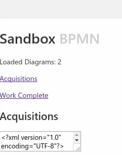

# Project Explorer

Sample front-end project repository for implementing features in Dora

## Installation

Ensure you have version `9.6.0` of [nodeJS](https://nodejs.org/en/download/) installed.

Install Dependencies:

```
 npm install
```

## Usage

Launch development environment with live reload

```
npm start
```

Build source code into distributable javascript

```
npm run build
```

Run test suite

```
npm test
```

## Reference Sheet

The following are some quick sheets into the technologies used to build this sample project.

* [bpmn-js](https://github.com/bpmn-io/bpmn-js) - BPMN Diagram viewer and modeller
* [typescript](https://www.typescriptlang.org/docs/handbook/typescript-in-5-minutes.html) - Strict typings and language features
* [mobx](https://mobx.js.org/getting-started.html) - Reactive state management
* [mobx-react](https://github.com/mobxjs/mobx-react) - React bindings for Mobx
* [office-ui-fabric-react](https://developer.microsoft.com/en-us/fabric) - Microsoft Fabric UI

## Coding Guidelines

The project has three configuration files included to help keep to guidelines. If you're using `vscode` ensure you have these extensions installed:

* [Prettier](https://github.com/prettier/prettier-vscode) - ext install prettier-vscode
* [EditorConfig](https://github.com/editorconfig/editorconfig-vscode) - ext install EditorConfig
* [Tslint](https://github.com/Microsoft/vscode-tslint) - ext install eg2.tslint

## Description



The sample project is a single page application with no router. By default it will display

* The number of diagrams in the store
* Each diagram title

When a diagram title is clicked it will show the title and xml of that diagram underneath. **These UI parts are just to help understand how the project fits together and may be removed**.

Depending on the task provided the `src/features/sandbox/Sandbox.tsx` will generally be the entry point for any new UI code/components added into the system.